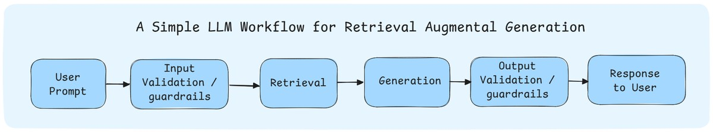
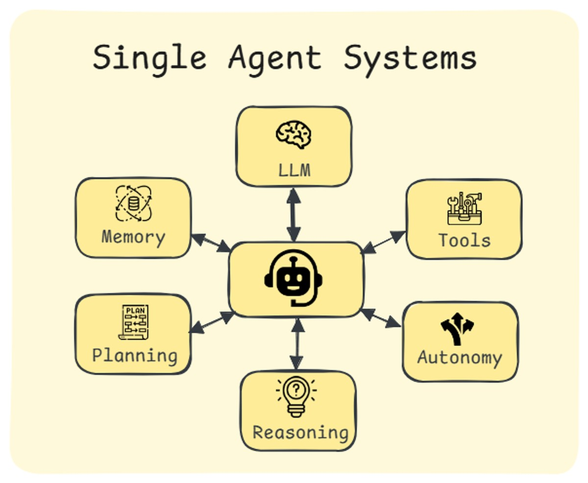
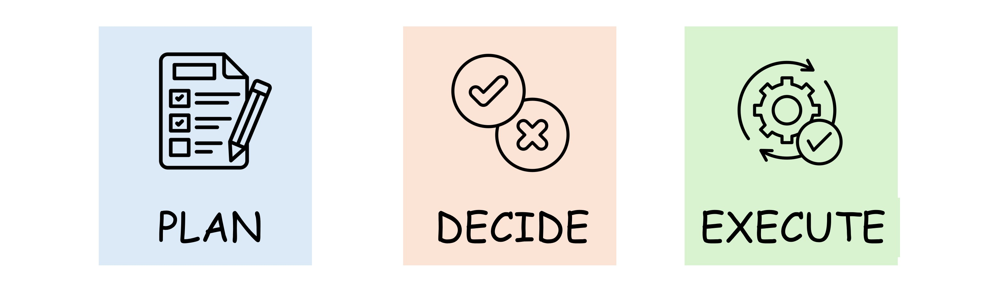
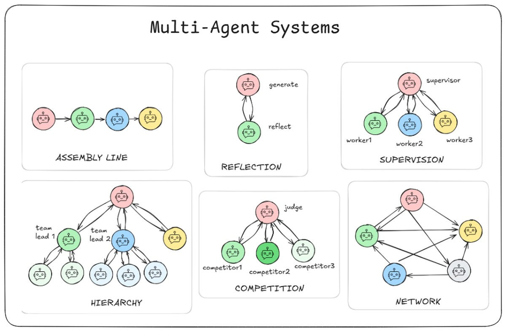

 <!-- RT_DIVIDER -->

---

[🏠 Home - All Lessons](https://app.readytensor.ai/hubs/ready_tensor_certifications)

[⬅️ Previous - Module 1 Project Description](https://app.readytensor.ai/publications/4n07ViGCey0l)
[➡️ Next - Agentic AI Core Components](https://app.readytensor.ai/publications/O8OHY0ehCvdr)

---

 <!-- RT_DIVIDER -->

# TL;DR

Agentic AI is about giving AI systems autonomy — moving from rigid workflows to agents that can plan and act, and eventually to multi-agent teams that collaborate. This lesson introduces that spectrum: workflows as predictable pipelines, agents as decision-makers, and multi-agent systems as coordinated problem-solvers.

---

 <!-- RT_DIVIDER -->

# Week 1: Introduction to Agentic AI Systems

Welcome to the first week of the Agentic AI Developer Certification. This is where our journey begins — by making sense of what exactly “Agentic AI” means, why it matters, and how it fits into the broader story of artificial intelligence.

## What You'll Learn This Week

By the end of this week, you'll have a solid understanding of:

- The meaning and significance of Agentic AI
- What AI Agents are and how they function
- Key differences between workflows and AI agents
- Core elements/components that make up AI agents
- Real-world applications of Agentic AI
- Popular tools and frameworks used in the field

Let's begin our journey into the world of Agentic AI 🚀

---

 <!-- RT_DIVIDER -->

# Why Agentic AI Matters

Traditional software, and even earlier AI, followed fixed rules and workflows. They executed what we told them, step by step.

**Agentic AI changes that.** Instead of just following a script, these systems can take a goal you provide and pursue it in flexible, adaptive ways. They can plan, make choices, adapt to obstacles, and act — all in service of the objective you’ve set.

That shift — from scripted execution to autonomous decision-making in pursuit of goals — is what makes Agentic AI powerful. It’s the difference between a tool that follows instructions and a collaborator that gets work done.

So what exactly are we talking about when we say 'Agentic AI'?

---

 <!-- RT_DIVIDER -->

# What is Agentic AI?

At its simplest, **Agentic AI is the autonomy engine for AI systems**. It’s the set of methods and design principles that let AI go beyond static scripts and start operating with initiative.

To make sense of this, it helps to think of Agentic AI as a **progression**:

1.  **Large Language Model (LLM) Workflows**  
    Here, the logic and flow are defined by us, the developers. The LLM is a component inside a predictable pipeline. Every step is laid out, and while the outputs may vary, the structure is fixed.

2.  **Single-Agent Systems**  
    Instead of a rigid pipeline, the AI itself can make decisions. An agent can decide _how_ to solve a problem, which tools to use, and in what order. It’s no longer just executing a flow — it’s reasoning and choosing.

3.  **Multi-Agent Systems**  
    Now imagine multiple agents, each with a role, collaborating on tasks. Some may coordinate centrally (like a supervisor assigning work), others may coordinate in a more decentralized way (like peers handing off tasks and exchanging information). This opens the door to much more complex, human-like teamwork.

We study LLM workflows in Module 1. Single and multi-agent systems are covered in Modules 2 and 3.

---

 <!-- RT_DIVIDER -->

## LLM Workflows

An **LLM workflow** is a pipeline that connects multiple steps into a repeatable process. For example:

A typical workflow: capture the user’s question, retrieve relevant context from a vector database (Module 1), feed that context into the LLM with a well-designed prompt, and return the answer.

That’s a workflow — clear, predictable, and testable. In fact, many real-world systems — like customer support assistants or domain-specific research tools — are built entirely on workflows like these.

At Ready Tensor, for example, our publication assessment tool is a workflow: publication + assessment criteria → evaluation report. It feels smart, but under the hood it’s a straightforward LLM-driven pipeline.

By definition, workflows don’t really have **autonomy**. They don’t decide on their own what to do next — every step is predefined. So are they truly agentic? We treat them as part of the agentic family because they use LLMs intelligently to accomplish impressive tasks, and more importantly, they form the foundation you build on before progressing to truly autonomous agents.

It’s also worth noting that a **well-designed workflow can often outperform a multi-agent system**. With clever prompting, careful orchestration, and the right tools, workflows are usually **faster, cheaper, and more reliable** than complex agent architectures — which is why they’re often the preferred production choice.

---

 <!-- RT_DIVIDER -->

:::tip{title="Tip"}
Don’t underestimate LLM workflows — they’re often the unsung heroes of production AI.
:::

---

 <!-- RT_DIVIDER -->

## Meet the Agent

So what makes an **agent** different?

Unlike a fixed workflow or chatbot, an agent **decides what to do next**: it evaluates the situation, chooses tools, and adapts if something doesn’t work.

At its core, this means agents can:

- **Plan** based on user input
- **Decide** autonomously
- **Act** to achieve an outcome

A useful way to think about this is the OODA loop: **Observe → Orient → Decide → Act**.

- **Observe**: gather input (a question, a document, an event).
- **Orient**: analyze and identify what matters.
- **Decide**: pick the next action (tool, prompt, or path).
- **Act**: execute — then loop back to observe.

This decision loop gives agents their flexibility: they can retry with a different tool, re-plan when blocked, and adapt in ways static workflows can’t.

---

 <!-- RT_DIVIDER -->

## From One Agent to Many

Now imagine scaling up. One agent is useful. But some problems are too complex for a single agent to handle. That’s where **multi-agent systems** come in.

In these systems, multiple agents with different strengths work together. Some may take a **centralized approach** — a supervisor agent decides who does what. Others may coordinate in a **decentralized way**, like peers exchanging information until the problem is solved.

You don’t need to worry about the details of agentic patterns yet. Just know that there are many patterns, and in **Module 2** we’ll dig into Reflection, Supervisor, Competitive, and other architectures. For now, it’s enough to know that **Agentic AI spans from workflows → single agents → teams of agents.**

At Ready Tensor, for example, we are currently working on an Agentic Authoring Assistant (A3) system that helps users create high-quality content more efficiently by leveraging the power of multiple AI agents working together. We will work on various components of the A3 system in modules 2 and 3 of this program.

---

 <!-- RT_DIVIDER -->

At this point, you’ve seen the full spectrum:

- **Workflows** that follow clear, predefined paths
- **Single agents** that decide and adapt on their own
- **Multi-agent systems** that coordinate teams of agents for bigger problems

This progression — from workflows to single agents to teams of agents — is the foundation of Agentic AI. Over the next modules, we’ll move from building simple workflows to designing and deploying full multi-agent systems.

Before we go further, take a moment to reflect on what these differences mean in practice.

---

 <!-- RT_DIVIDER -->

# Reflection

- Think of an AI system you’ve used recently (e.g., ChatGPT, GitHub Copilot, a support chatbot). Did it feel like a workflow tool following a script, or more like an agent making choices? What clues made you feel that way?
- Where do you think most real-world AI applications sit right now: workflows, single agents, or multi-agent systems? Where do you think things are headed in the next few years?
- Suppose you were tasked with writing a movie script and you want an AI system to help. Is this a workflow application, or a multi-agent system?
- As you begin this certification, which excites you more: building reliable workflows or experimenting with flexible agents?

---

 <!-- RT_DIVIDER -->

# Test Your Understanding

Check out this short video that asks some critical questions about Agentic AI:

:::youtube[Title]{#p4YLpCTAdA8}

---

 <!-- RT_DIVIDER -->

# Looking Ahead

This week is all about laying foundations. You now have a high-level mental model:

- Workflows are predictable pipelines (our main focus in Module 1).
- Agents bring autonomy — they plan, decide, and act.
- Multi-agent systems coordinate groups of agents to tackle complex tasks.

In the next lesson, we’ll zoom in on the **core components of an agent** — LLMs, tools, memory, planning, and more. Those building blocks will carry through the rest of the program.

 <!-- RT_DIVIDER -->

---

[🏠 Home - All Lessons](https://app.readytensor.ai/hubs/ready_tensor_certifications)

[⬅️ Previous - Module 1 Project Description](https://app.readytensor.ai/publications/4n07ViGCey0l)
[➡️ Next - Agentic AI Core Components](https://app.readytensor.ai/publications/O8OHY0ehCvdr)

---
