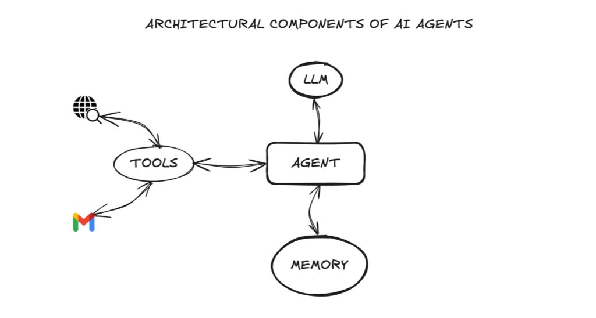
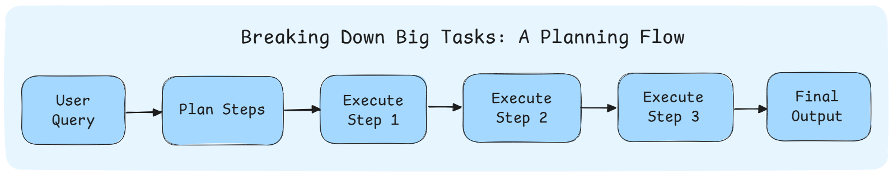
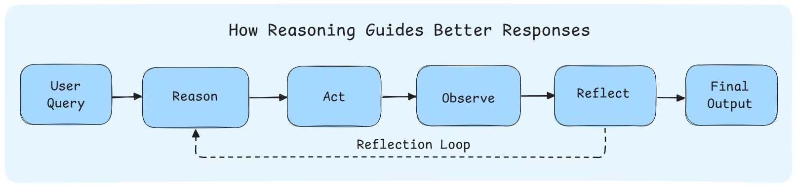
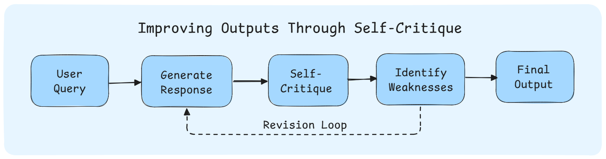
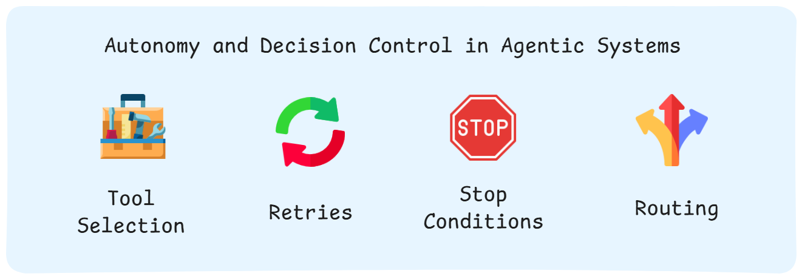

<!-- RT_DIVIDER -->

---

[🏠 Home - All Lessons](https://app.readytensor.ai/hubs/ready_tensor_certifications)

[⬅️ Previous - What is Agentic AI](https://app.readytensor.ai/publications/g8QivAEShqgw) [➡️ Next - Real-World Applications](https://app.readytensor.ai/publications/EbfPXrWQMeCh)

---

<!-- RT_DIVIDER -->

# TL;DR

Agentic systems are made of two layers: architectural components like LLMs, tools, and memory, and behavioral components like planning, reasoning, and refinement that we design into the system. This lesson breaks down how those layers work together — and gives you a high-level map for building intelligent, goal-driven AI.

---

<!-- RT_DIVIDER -->

# Building Smarter Systems: What’s Really Inside an Agent?

In the [last lesson](https://app.readytensor.ai/publications/g8QivAEShqgw), we looked at how Agentic AI breaks free from static workflows — moving beyond rigid scripts to systems that can plan, decide, and act. That naturally leads to a question:

👉 _If you opened up an agentic system, what would you actually find inside?_

You wouldn’t just find a single AI model or a fancy prompt.

You’d find a composed system — built from architectural parts that give it raw capabilities, and carefully designed behaviors that make it act with intelligence.

In this lesson, we’ll peel back the layers and explore two key ingredients of any agentic system:

- The **architectural components** like LLMs, tools, and memory that form the system’s foundation
- The **behavioral components** — patterns like planning, reasoning, and refinement — that help it make better decisions

We’ll also look at how these pieces are orchestrated together to create real autonomy — and end with a glimpse of a real-world system you’ll build later in the program.

By the end, you’ll have a clear mental model for how agentic systems are built — and why the magic lies not in the model, but in the system design.

---

<!-- RT_DIVIDER -->

# The Architectural Components

Let's start with the building blocks of agentic systems - the LLM, tools, and memory. If an agent were a person, these would be its organs — the indispensable parts that keep it alive and functioning. Strip everything else away, and three pieces remain at the heart of every agent:

<!-- RT_DIVIDER -->

## Large Language Model (LLM) – The Brain 🧠

At the heart of every AI agent is a Large Language Model — the part that processes text input and generates text output.

The LLM is what gives the agent its ability to work with language. It takes in the user's request, processes the available information, and produces responses in natural language. Think of it as the **central processing unit** that transforms text inputs into meaningful text outputs.

The LLM provides the language understanding and generation capabilities that make human-AI interaction possible. Without this core, the rest of the agent lacks the ability to communicate effectively.

---

## Tools – The Hands 🛠 ️

An agent without tools is like a person who can think but can’t touch the world. Tools let agents do things beyond their built-in knowledge: search the web, run a database query, call an API, even spin up a calculator.

In agentic systems, we often wire agents to vector databases or search utilities. This means when the system needs external knowledge, it can fetch it using available tools.

In essence, tools are what transform an agent from a “talker” into a true “doer.”

---

## Memory – The Recall 🧩

Finally, memory gives the agent continuity. Imagine talking to someone who forgets everything you said two minutes ago — frustrating, right? That’s what an agent without memory feels like.

There are two main flavors:

- **Short-term memory** keeps track of the ongoing conversation so the agent can stay coherent within a session.
- **Long-term memory** persists information across sessions — like remembering your name, past questions, or specific preferences.

This makes interactions feel personal and consistent. When your assistant recalls that you prefer bullet-point answers or already asked a similar question last week, that’s memory at work.

---

<!-- RT_DIVIDER -->

Put these together and you’ve got the **architecture of an agent**: a brain (LLM), hands (tools), and recall (memory). Each one adds capability. But without the right patterns guiding how they work together, they’re just raw parts — not yet a reliable system. The next piece of the puzzle is **behavioral components** — how we shape these building blocks into a smarter and reliable system that actually sticks the landing.

---

<!-- RT_DIVIDER -->

# The Behavioral Components

Picture this: you’ve picked the most advanced LLM you can get your hands on. You’ve wired it up with powerful tools. You’ve even given it memory so it never loses context.

Now you hand it a complex task:

> _“Research the latest trends in renewable energy and draft a 2-page executive summary with sources.”_

Will you get a great, trustworthy answer?

**Probably not.**

Think about how humans carry out complex tasks. We plan, reason, break problems down, critique, and refine until the result is solid.

We can — and must — design AI systems to do the same. That’s the role of **behavioral components**: the patterns and control flows that guide an agent’s behavior.

These aren't built-in features of the LLM. They're intentional design choices — specific prompting strategies, control flows, and system patterns that shape how the agent behaves.

Anyone can connect an LLM to a database or a set of tools. But getting that system to plan, reason, and improve its own outputs? That requires behavioral design.

---

<!-- RT_DIVIDER -->

## Planning – Breaking Down Complexity 📋

Smart people don’t tackle big tasks in one leap. They break them down. “First I’ll gather information, then I’ll outline the key points, then I’ll write.”

Agents need the same habit. Through strategies like **Chain-of-Thought prompting** or **self-ask** (covered in next week's lessons), we guide them to think in steps rather than blurting out a final answer.

Prompting agents to plan makes their behavior more aligned to the demands of the task — resulting in better, human-like responses.

---

<!-- RT_DIVIDER -->

## Reasoning – Working It Through 🔍

When you face a question like _“Where’s the best place to visit in Italy in October?”_ you don’t just blurt “Rome.” You consider the weather, the type of trip, the season.

Agents can be nudged into the same careful reasoning. Patterns like **ReAct** push them to weigh options, use tools, and explain choices. You will learn about ReAct later in this module.

The result isn’t magic — it’s engineered reasoning that feels systematic, transparent, and trustworthy.

---

<!-- RT_DIVIDER -->

## Refinement – Improving the Draft 🔄

Humans rarely settle for a first draft. We reread, critique, and polish. That’s how raw ideas become something professional.

Agents can do this too. With techniques like **self-critique** or the **Reflection pattern** (where one agent writes and another critiques), systems can iterate and improve their outputs before showing them to the user.

It’s a simple design choice that instantly makes results feel sharper and more reliable.

---

<!-- RT_DIVIDER -->

:::info{title="You’ll Learn All of This"}

The strategies mentioned here — from Chain-of-Thought and Self-Ask, to ReAct and Reflection — aren’t just buzzwords. You’ll learn how to use each of them in this certification program, with hands-on examples and real system builds.

We don’t just talk about agentic behaviors — we teach you how to implement them.

:::

---

<!-- RT_DIVIDER -->

## Autonomy and Decision Control – Choosing the Next Move ⚡

Autonomy is the defining trait of agentic systems.

Traditional AI follows fixed instructions. Agentic systems **choose** their next move.

When faced with ambiguity, failure, or new information, they don’t freeze or guess — they adapt. That adaptability is autonomy in action.

> _“Should I try again with a different approach?”_ > _“Is this enough to respond, or should I keep looking?”_ > _“Which tool gives me the best shot at solving this?”_ > _“Is my current solution good enough, or should I refine it?”_

These aren’t prompts we give the model. These are **decisions the system is allowed to make** — because we’ve embedded mechanisms for **tool selection, retries, stop conditions, and routing**.

At the heart of autonomy is this ability to assess, adapt, and act — without needing constant direction.

That’s what transforms an AI from a static assistant into a dynamic agent. And it’s the behavioral layer that makes it possible.

---

<!-- RT_DIVIDER -->

**👉 The big picture:** Behavioral components aren’t things the LLM magically knows how to do. They’re behaviors we engineer in, habits of human problem-solving translated into system design. And they’re what transform raw capability into reliable intelligence.

---

<!-- RT_DIVIDER -->

# Orchestration – Designing the Full System 🧩

Once you’ve chosen the right components and behavioral patterns, the final step is putting them together — not as a script, but as a **system**.

That’s what orchestration is: the **architecture of the entire graph** — how agents, tools, prompts, and control logic are composed into a cohesive flow.

This includes decisions like:

- **Which system pattern to use**: Chain, Supervisor, Network, Hierarchy, or something custom (we learn about these in module 2).
- **How nodes are connected**: What routes data between them? When do we switch paths?
- **What happens when things go wrong**: Agentic systems are fragile — you’ll need **fallbacks**, **retries**, **timeouts**, and **stop conditions** to make them reliable.

You can think of orchestration as the **blueprint behind the agent’s brain** — the part that decides how thinking, acting, critiquing, and refining all work together in practice.

We’ll walk you through this in future modules — but for now, just remember:

> 🧠 A well-designed system isn’t just smart at each step. It’s smart in how the steps fit together.

---

<!-- RT_DIVIDER -->

# What Comes Next

By now, you’ve seen what powers an AI agent: not just a smart model, but a smart **system** — built from architectural blocks, shaped by behavioral design, and stitched together with careful orchestration.

In the coming lessons and modules, you’ll learn how to build all of this — piece by piece — and turn these ideas into real, working agents.

You won’t just understand how agentic systems work.

You’ll know how to make them.

---

<!-- RT_DIVIDER -->

# Reflect and Test Your Understanding 🎥

Watch the short video below to challenge your understanding of the core components of AI agents.

> **📌 Note:** This lesson has been updated since the video was recorded, so you may notice some visual or wording differences. That’s expected — the video still covers the right concepts and questions for this lesson.

:::youtube[Title]{#rGkCfhM7jso}

<!-- RT_DIVIDER -->

---

[🏠 Home - All Lessons](https://app.readytensor.ai/hubs/ready_tensor_certifications)

[⬅️ Previous - What is Agentic AI](https://app.readytensor.ai/publications/g8QivAEShqgw) [➡️ Next - Real-World Applications](https://app.readytensor.ai/publications/EbfPXrWQMeCh)

---
