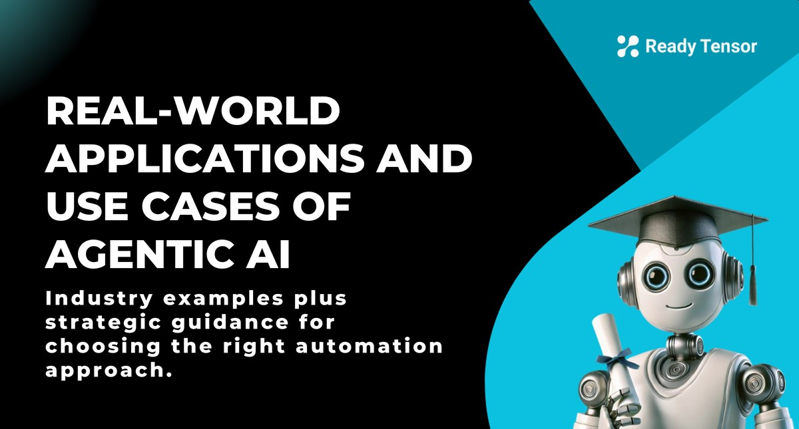
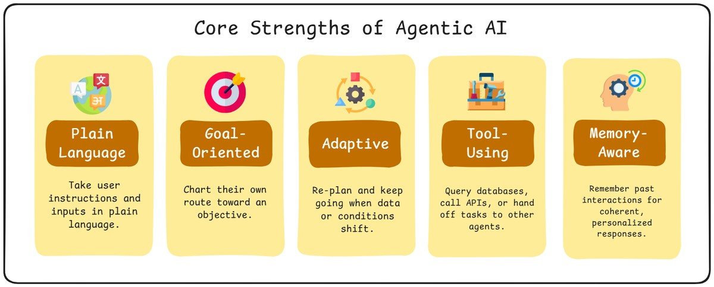
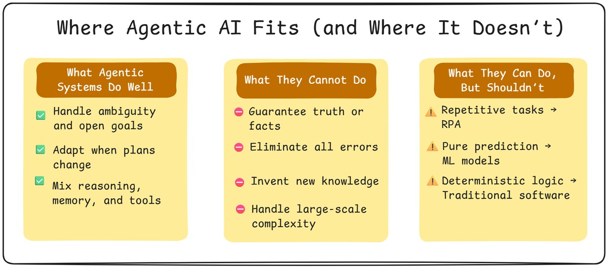

<!-- RT_DIVIDER -->

---

[🏠 Home - All Lessons](https://app.readytensor.ai/hubs/ready_tensor_certifications)

[⬅️ Previous - Agentic AI Core Components](https://app.readytensor.ai/publications/O8OHY0ehCvdr) [➡️ Next - Tools of the Trade](https://app.readytensor.ai/publications/hjbeURATH5ul)

---

<!-- RT_DIVIDER -->

# TL;DR

Agentic AI systems are already finding their way into healthcare, finance, logistics, education, and beyond — not as static chatbots, but as adaptive problem-solvers that understand plain language, pursue goals, adapt to change, use tools, and learn from memory. These capabilities make them powerful for complex, ambiguous, or dynamic tasks where rigid scripts fall short. But they’re not always the right tool: repetitive tasks may be cheaper with RPA, prediction is often best handled by traditional ML, and many problems are solved just fine with workflows. In this lesson, you’ll learn how to tell the difference — and build a mental model for spotting when agentic AI is the right fit.

---

<!-- RT_DIVIDER -->

# The Promise of Agentic AI

Picture this: a customer support system that doesn’t just answer FAQs, but detects frustration in your tone, reroutes your case, and follows up with a personalized solution. Or a research assistant that doesn’t just pull relevant documents, but plans an analysis, compares findings, and drafts a structured summary.

This is the promise of agentic AI: systems that feel less like static software and more like collaborative teammates — able to plan, adapt, and act in pursuit of a goal. It’s no wonder organizations across healthcare, finance, logistics, and education are racing to explore what these systems can do.

But what exactly gives agentic AI this edge? Let’s break down the core strengths that set it apart.

---

<!-- RT_DIVIDER -->

# Core Strengths of Agentic AI

Agentic AI systems bring a handful of defining capabilities that make them stand out — and make them useful in places where other techniques fall short. These strengths include:

**1. They understand and act on plain language.** One of the biggest shifts agentic systems bring is their ability to understand and act on plain language. You don’t have to code a workflow or define every step. You can simply say, _“Summarize these three reports and flag contradictions,”_ and the agent figures out what to do.

**2. They pursue goals, not just tasks.** Traditional automation works when every step is predictable. Agentic systems are different: you tell them the destination, and they chart the route. If the first tool doesn’t work, they can try another. If the data is incomplete, they can look for alternatives. It’s goal-seeking behavior rather than step-following execution.

**3. They adapt when the unexpected happens.** In the real world, plans rarely unfold neatly. A static script breaks when something changes; an agent can re-plan and keep going. That adaptability is what makes agentic AI powerful for open-ended or evolving problems, whether it’s adjusting to new information in a research task or rerouting around supply chain delays.

**4. They can use tools and delegate.** Instead of being limited to language output, agents can reach out — query a database, run a calculation, hit an API, or even hand work off to another agent. This turns them from passive responders into active participants in workflows.

**5. They build continuity with memory.** An agent isn’t starting from zero every time. With memory, it can carry lessons from past interactions forward, remember user preferences, and maintain context across sessions. This is what makes interactions feel personal and coherent over time.

Taken together, these capabilities make agentic AI powerful. Yet, without care, it’s easy to overuse them. Next, we’ll draw the lines on when they fit and when they don’t.

---

<!-- RT_DIVIDER -->

# Clarifying the Boundaries

Agentic systems are powerful, but they’re not magic. They don’t replace every kind of automation, and they’re not always the most efficient or cost-effective solution. In fact, many problems are solved better by simpler tools — whether it’s a rules-based script, robotic process automation (RPA), or a traditional machine learning model.

To see where agentic AI truly shines, it helps to draw the lines clearly. These systems are valuable, but they’re not a catch-all solution.

**What agentic systems do well** They’re at their best when problems are **ambiguous, dynamic, or multi-step**. If the path forward isn’t obvious, if new information might change the plan, or if a mix of reasoning, memory, and tool use is required, then an agentic system can outperform rigid scripts. Think of research assistants that sift through messy sources, or supply-chain agents that adapt to shifting conditions.

**What they cannot do** Some tasks simply fall outside their scope. Agents don’t invent new scientific knowledge or make guarantees of truth; they work with the tools and data we give them. And when the tolerance for error is zero — say, in life-critical medical decisions or financial compliance checks — you don’t want an autonomous agent making the final call without strict safeguards and human oversight.

**What they _can_ do, but shouldn’t** Here’s the tricky part: there are many tasks an agent _could_ handle, but where it’s the wrong tool. For highly repetitive, deterministic processes — things like form-filling, copy-paste data transfers, or standardized report generation — **robotic process automation (RPA)** is cheaper and more reliable. For pure prediction problems — like forecasting credit risk, classifying spam, or detecting fraud patterns — **traditional machine learning models** are faster, cheaper, and often more accurate. And for tasks that follow the exact same sequence every time, **workflows** or scripted pipelines beat the overhead of building an autonomous system.

---

<!-- RT_DIVIDER -->

# Examples: Where Agentic AI Shines

The best way to see the value of agentic systems is through real examples where they are clearly the right tool for the job. Here are three such scenarios:

**1. Contextual Email Search** Ask, _“Do I have any emails from Abhy?”_, and instead of just keyword-matching, an agent can resolve nicknames and aliases across accounts. If it doesn’t find an exact match, it might clarify: _“I can’t find anyone named Abhy, but I do see Abby — is that who you meant?”_ When you confirm, it retrieves the relevant messages, deduplicates threads, and delivers a clean briefing of what matters — even suggesting follow-ups you might need.

**2. Dynamic News Summarization** Say, _“What’s trending in NYT news today?”_ and the agent doesn’t just scrape headlines. It queries multiple sources, filters duplicates, cross-checks for bias, and summarizes trends with timestamps so you know what’s current and trustworthy.

**3. Team Knowledge Retrieval** When you ask, _“What did my team say in Slack about the demo?”_, the agent can scan channels, pull decisions and action items, link relevant Jira issues, and draft a status note you can post with one click.

These examples highlight the sweet spot for agentic AI: plain language goals, ambiguous input, tool use, and the need for synthesis — things rigid workflows or static models can’t handle gracefully.

---

<!-- RT_DIVIDER -->

# Real-World Applications of Agentic AI

We’ve seen the strengths, limits, and sweet spots—now here are concrete applications, starting with cross-industry patterns. These are just examples: the real potential of agentic AI spans nearly every industry.

**Customer Support (Cross-Industry)**

- **Virtual assistants** that resolve the majority of queries without human intervention — a strong fit because conversations are unpredictable, and agents can flexibly interpret intent.
- **Sentiment-aware routing systems** that detect frustration and escalate complex cases — ideal for agentic systems since they adapt beyond fixed rules.

**Marketing (Cross-Industry)**

- **Campaign assistants** that help create copy, visuals, and collateral across multiple channels — well-suited since campaign design is open-ended, iterative, and requires juggling many assets and styles.

**E-Commerce & Fashion**

- **Shopping assistants** that interact in plain language to suggest products, draw on past purchases, and adapt to user preferences — a natural extension of agentic AI’s strengths in contextual reasoning and personalized recommendations.

**Healthcare**

- **Diagnostic assistants** that help physicians cross-reference symptoms against medical literature — high-risk if left unchecked, but powerful as human-in-the-loop support. With RAG or fine-tuned models, these systems can bring vast knowledge to a clinician’s fingertips.
- **Radiology assistants** that highlight potential anomalies in imaging scans — another high-stakes area, but a classic case for human-in-the-loop design: the radiologist retains authority, while the agent accelerates and enriches the review process.

**Finance**

- **Personal finance assistants** offering budgeting and portfolio insights — in the near term, these will likely operate with financial advisors in the loop, who can override or validate recommendations due to compliance rules. Regulation may slow full autonomy, but expect steadily increasing agent assistance.

**Education**

- **Adaptive tutoring agents** that tailor explanations to individual learning styles — well-suited for the open-ended, varied nature of learning.
- **Automated grading assistants** that provide structured, detailed feedback on assignments — a natural application, since feedback must flex to diverse student responses.

**Software Development**

- **Coding assistants** like GitHub Copilot and Cursor that generate, refactor, and explain code — a sweet spot for agentic AI because software development is iterative, open-ended, and tool-rich.
- **DevOps agents** monitoring commits and CI/CD pipelines — these systems can catch errors early, suggest fixes, and even trigger corrective workflows automatically.

**Legal**

- **Contract review assistants** that surface risky clauses and highlight inconsistencies — valuable for parsing complex, context-heavy documents at scale.
- **Legal research assistants** that scan case history and surface relevant precedents — ideal for synthesis-heavy tasks where breadth and context matter.

**Research**

- **Scholarly research assistants** that conduct literature reviews, help draft manuscripts, and even critique early drafts — a strong fit for agentic systems because the work requires broad retrieval, synthesis, and refinement rather than deterministic rules.

---

<!-- RT_DIVIDER -->

Taken together, these examples show how agentic AI complements existing forms of automation rather than replacing them. RPA, traditional ML, and workflows still excel in deterministic or narrowly defined tasks. But when ambiguity, adaptation, and synthesis are required, agentic systems step in as the right tool for the job.

---

<!-- RT_DIVIDER -->

:::info{title="Info"}

# Your Decision Framework: The Right Tool for the Job

To make this lesson practical, we’ll leave you with a simple checklist — a quick way to decide whether a use case really calls for agentic AI, or whether RPA, ML, or a scripted workflow would be the smarter choice.

**Start with the stakes:**

- **Could failure cause serious harm?** (medical diagnosis, financial compliance, safety systems) → Stick with proven automation + human oversight. Add agents only for low-risk tasks like documentation or triage.

**Then assess the problem type:**

- **Is success defined by doing the same thing perfectly, every time?** → **RPA or traditional automation**
- **Is this fundamentally a prediction problem?** (Will this customer churn? Is this transaction fraud?) → **Traditional ML model**
- **Does the task follow a fixed sequence but benefit from language understanding?** → **Scripted workflow** with LLM components

**If none of those fit, check for agentic signals:**

- **Does the path depend on what you discover along the way?** ✓ Agentic
- **Do you need reasoning across multiple information sources?** ✓ Agentic
- **Will the approach vary based on context or user intent?** ✓ Agentic
- **Is tool selection part of the problem-solving?** ✓ Agentic

**Finally, the reality check:**

- **Do you have clean data and reliable tools to give the agent?** If not, fix the foundation first.
- **Can you afford the unpredictability?** Agents are more flexible but less predictable than scripts.
- **Is the complexity worth it?** Sometimes a simple workflow that handles 80% of cases beats a sophisticated agent that handles 95%.

**The bottom line:** If you can write clear if-then rules for the entire process, you probably don't need an agent. If the decision tree would have hundreds of branches or the "right approach" depends on understanding messy, ambiguous input, that's where agentic systems earn their keep.

:::

---

<!-- RT_DIVIDER -->

# Wrapping Up: Powerful, But Not God-Like

Agentic AI is one of the most exciting shifts in technology today. We’ve seen its defining capabilities, the boundaries of where it fits, the sweet-spot scenarios that highlight its strengths, and the breadth of applications already unfolding across industries.

But it’s worth ending with a reminder: these systems are powerful, not magical. They optimize for usefulness under uncertainty—they don’t guarantee correctness, eliminate errors, or replace human judgment in high-stakes settings. For many tasks, simpler tools like RPA, traditional ML models, or scripted workflows remain cheaper, faster, and more reliable.

The key takeaway is this: **Agentic AI is immensely valuable when applied to the right problems — open-ended, dynamic, and tool-rich tasks that require reasoning and adaptation.** Like any tool, its power comes from knowing when and how to use it.

As you move forward in this program, keep this balance in mind: be excited about what’s possible, but also realistic about the limits. That mindset will help you build systems that are not just clever, but useful, reliable, and ready for the real world.

---

<!-- RT_DIVIDER -->

# Reflect & Test Your Understanding 🎥

Take a moment to think about these questions before moving on:

- Which industry do you believe could benefit the most from Agentic AI — education, finance, retail, or something else? Why?
- In what use cases could poorly implemented Agentic AI cause the most harm? Consider areas like healthcare, large-scale media, or weapons systems.
- Coding assistants are one of the fastest-growing Agentic AI applications. Some even predict we might see a single-person unicorn startup — a billion-dollar company run largely by agents. Do you think that’s possible? If so, how many years away might it be?
- Imagine a friend tells you she’s building a stock-trading bot to replace her wealth adviser. Would you consider this a good or bad use of Agentic AI? Why? Consider using the decision framework we just covered to evaluate this scenario.

🎥 _Watch this short video for a recap of Agentic AI’s strengths — and some cautions about where it may not be the right fit, such as compliance, privacy, or explainability. It’s a quick way to reinforce the “use the right tool for the job” mindset before moving on._

> 📌 Note: This video was recorded before the lesson update, so visuals and wording may differ — but the core concepts and questions remain spot on.

:::youtube[When to use Agentic AI]{#00gON60Mrts}

<!-- RT_DIVIDER -->

---

[🏠 Home - All Lessons](https://app.readytensor.ai/hubs/ready_tensor_certifications)

[⬅️ Previous - Agentic AI Core Components](https://app.readytensor.ai/publications/O8OHY0ehCvdr) [➡️ Next - Tools of the Trade](https://app.readytensor.ai/publications/hjbeURATH5ul)

---
